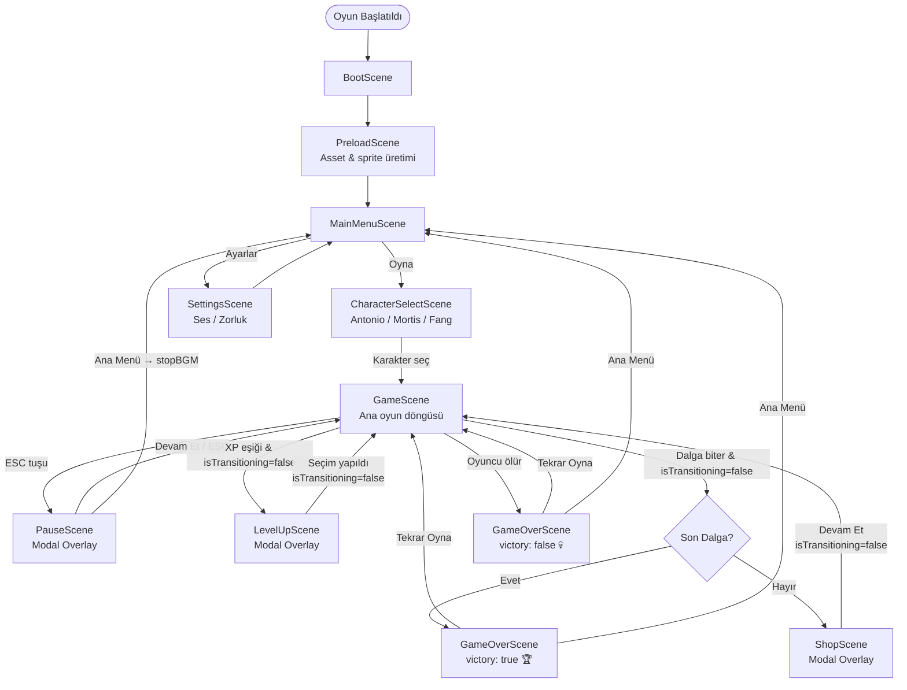
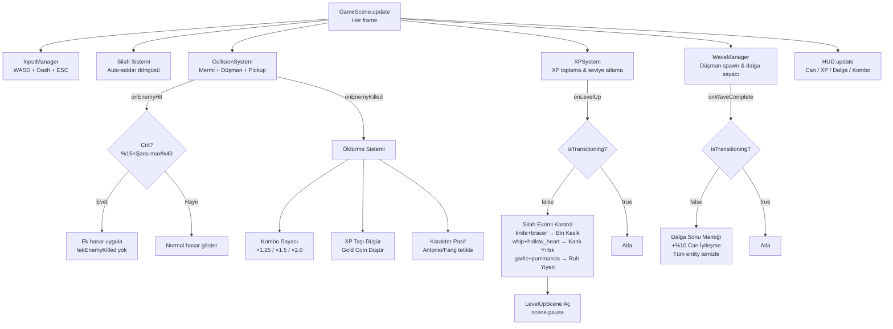
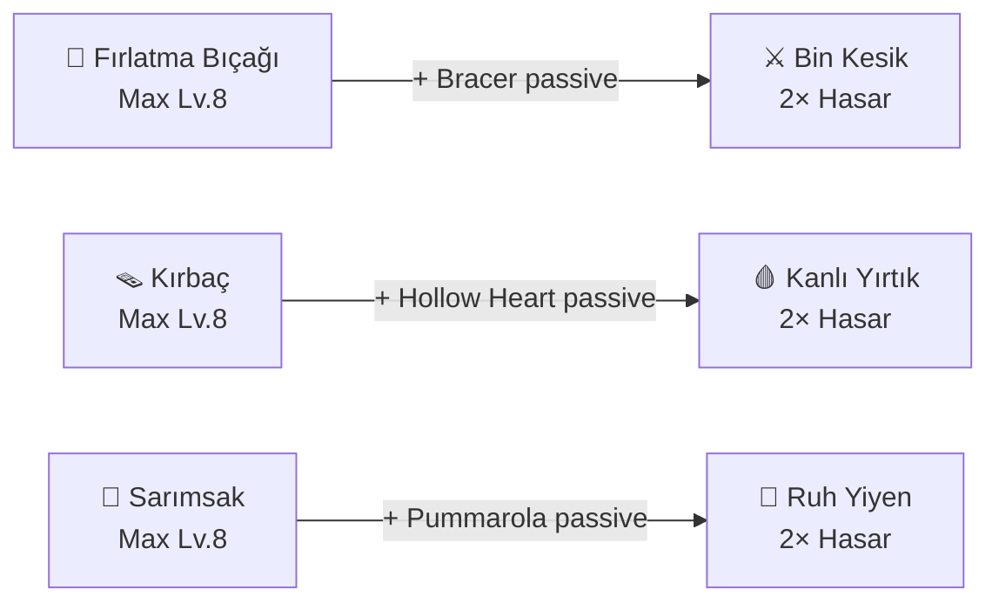

# Şafak Yok — Oyun Akış Diyagramı

## Sahne Geçiş Akışı

---

## Oyun İçi Sistemler Akışı

---

## Silah Evrim Sistemi

---

## Sahne Eş Zamanlılık Tablosu

| Durum | Aktif Sahneler |
|-------|---------------|
| Normal Oyun | GameScene ✅ |
| Level-Up | GameScene ⏸ + LevelUpScene ✅ |
| Dalga Arası | GameScene ⏸ + ShopScene ✅ |
| Pause | GameScene ⏸ + PauseScene ✅ |
| Oyun Bitti | GameOverScene ✅ |

> **Not:** `isTransitioning` bayrağı sayesinde LevelUpScene ve ShopScene aynı anda açılamaz (BUG-3 düzeltmesi).

---

## Düzeltilen Buglar Özeti

| # | Bug | Dosya | Düzeltme |
|---|-----|-------|----------|
| 1 | Damage passive toplamalı | LevelUpScene, ShopScene | `+= 0.1` → `*= 1.1` |
| 2 | Crit çift öldürme callback | GameScene | Fazladan `onEnemyKilled` çağrısı kaldırıldı |
| 3 | Aynı karede çift sahne | GameScene | `isTransitioning` bayrağı eklendi |
| 4 | LevelUp çift tıklama | LevelUpScene | `selected` guard eklendi |
| 5 | BGM Ana Menü'de çalmaya devam | PauseScene | `stopBGM()` Quit öncesi çağrıldı |
| 6 | Boss HP formülü karmaşık | WaveManager | `1+x-1` → `Math.floor(wave/5)` |
| 7 | Geç oyun gold açlığı | WaveManager | Çarpan `0.15` → `0.20` |
| 8 | Silah lv6-8 mermi plateausu | WeaponBase | Level 7'de de +1 mermi |
| 9 | Necromancer tint çakışması | Enemy | Phase-2 kontrolü sonrası tint temizle |
| 10 | Archer mesafe tutarsızlığı | Enemy | Ateş mesafesi 350 → 300px |
| 11 | Biased shuffle | LevelUpScene, math.ts | Fisher-Yates algoritması |
